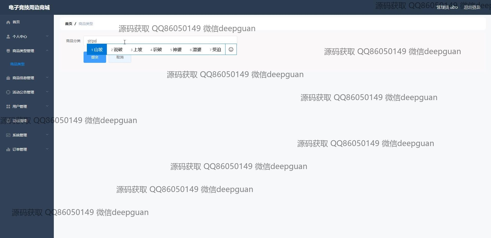
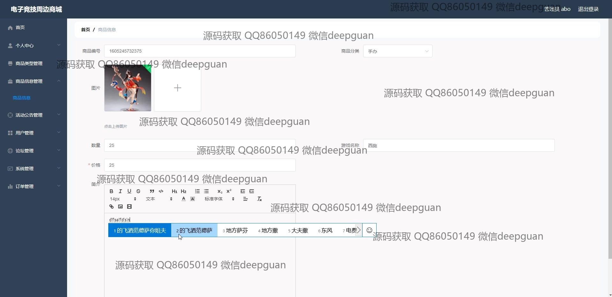
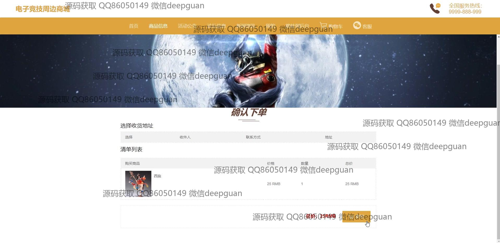
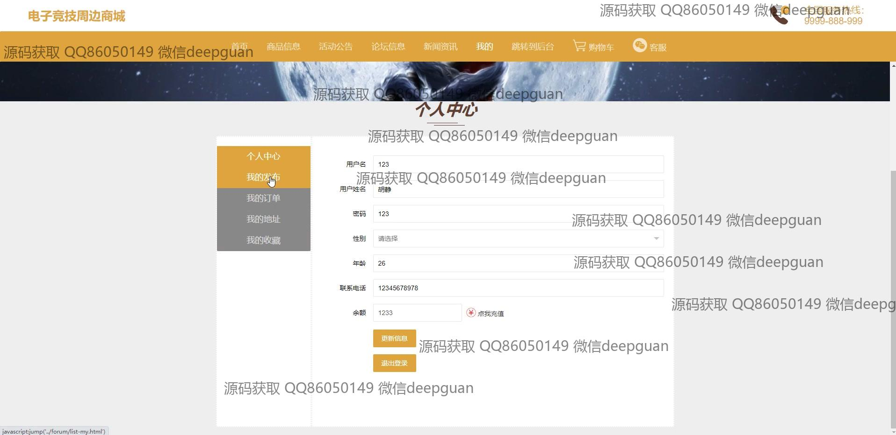

<h1 align="center">的电子竞技周边商城vue</h1>

## 简介
电子竞技周边商城系统：角色分为管理员、用户；主要功能包括商品管理、订单管理、用户管理、购物车功能、论坛信息发布、个人信息修改及登录注册等。    --计算机毕业设计源码；毕设源码；java毕业设计源码

## 联系方式

<h3 align="center">获取完整代码与数据库文件 + 微信：deepguan QQ: 86050149 QQ群: 783742310</h3>

<h3 align="center">可帮忙远程部署 包运行成功！提供远程部署、修改代码、设计文档指导、代码讲解等服务！</h3>

## 功能介绍（完整见运行截图）
管理员：基本功能包括登录、注册、和退出网站。网站首页设有主导航栏，供访问用户管理、论坛管理、系统管理和订单管理等模块。商品模块提供添加和管理商品的功能，包括产品图片上传、数量和价格输入、商品描述编辑，以及分类和游戏名称等字段。此外，管理员可管理用户信息，查看和回复客户留言，以及发布论坛信息和新闻资讯。个人中心功能允许管理员查看和修改个人信息，并管理订单。

用户：用户可以通过登录和注册访问电子竞技周边商城。主页提供直观的导航栏，包含商品信息、活动公告等模块，便捷的购物体验可通过购物车、订单确认和付款功能实现。用户能在个人中心查看和编辑个人信息，如用户名、昵称、密码、性别、年龄和联系电话等，此外还能管理订单、收藏和地址。用户在浏览商品详情时，可以利用商品搜索功能快速定位所需的电竞周边产品，与客服聊天窗口沟通咨询。

## 运行截图

本代码来源于网络,仅供学习参考使用!

